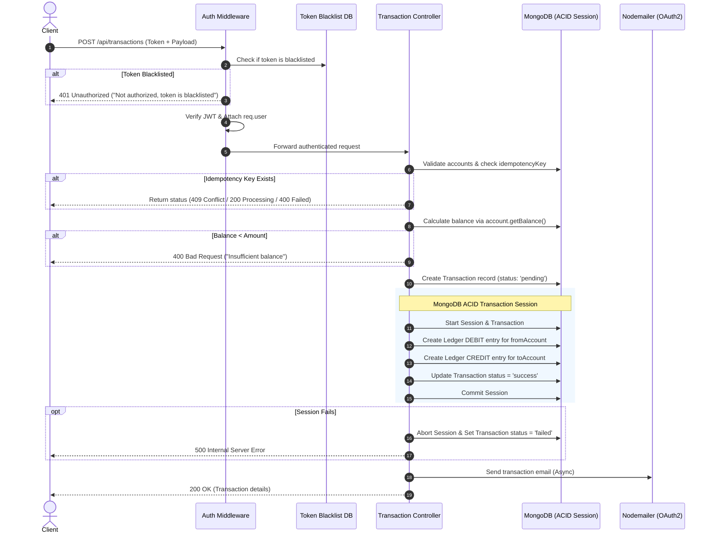
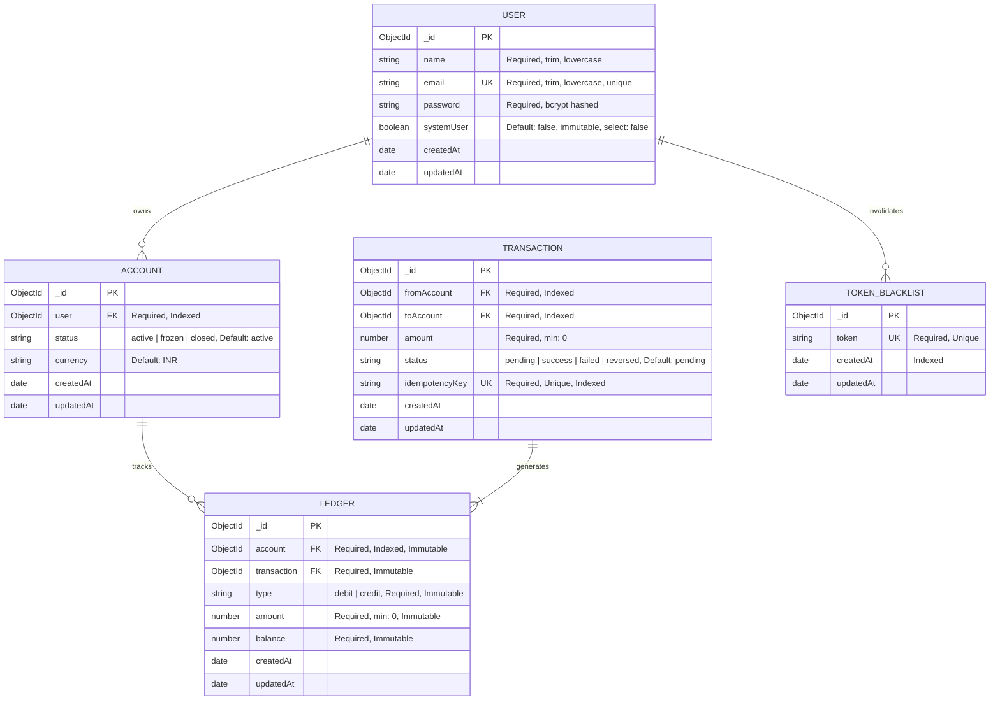

# 💳 Transaction Ledger API

[](https://nodejs.org/)
[](https://expressjs.com/)
[](https://www.mongodb.com/)
[](https://jwt.io/)
[](https://nodemailer.com/)

> **ACID-Compliant Double-Entry Ledger & Financial Transaction Management REST API.**  
> Built with Node.js, Express, MongoDB (Mongoose), JWT authentication with token blacklisting, and Nodemailer email alerts.

---

## 📑 Table of Contents

- [Overview](#-overview)
- [Core Features](#-core-features)
- [System Architecture & Flow](#-system-architecture--flow)
- [Database Schema Design](#-database-schema-design)
- [API Reference](#-api-reference)
  - [1. User Authentication (`/api/users`)](#1-user-authentication-apiusers)
  - [2. Account Management (`/api/accounts`)](#2-account-management-apiaccounts)
  - [3. Transaction Operations (`/api/transactions`)](#3-transaction-operations-apitransactions)
- [Idempotency & Concurrency Model](#-idempotency--concurrency-model)
- [Directory Structure](#-directory-structure)
- [Getting Started](#-getting-started)
  - [Prerequisites](#prerequisites)
  - [Installation](#installation)
  - [Environment Configuration](#environment-configuration)
  - [Running the Application](#running-the-application)
- [Security & Integrity Measures](#-security--integrity-measures)

---

## 📖 Overview

The **Transaction Ledger API** is a financial transaction backend engineered to guarantee data consistency, prevent double-spending, enforce request idempotency, and maintain an immutable ledger audit trail.

All transfers adhere to the **Double-Entry Bookkeeping** principle: every transaction simultaneously writes equal debit and credit records within a single atomic MongoDB multi-document session.

---

## ⚡ Core Features

- **Double-Entry Bookkeeping Ledger**: Every money movement creates linked `debit` and `credit` records in the `Ledger` collection.
- **Ledger Immutability Guards**: Mongoose pre-hooks block all update and delete actions on the `Ledger` model (`updateOne`, `updateMany`, `findOneAndUpdate`, `findByIdAndUpdate`, `deleteOne`, `deleteMany`, `findOneAndDelete`, `findOneAndReplace`, `remove`).
- **ACID Database Transactions**: Multi-document atomic transactions via Mongoose sessions (`startSession`, `startTransaction`, `commitTransaction`, `abortTransaction`) guarantee that either both debit and credit succeed or the transaction rolls back completely.
- **Enforced Idempotency**: All transfer requests require a unique `idempotencyKey`. The system checks existing keys to prevent duplicate execution across retries and race conditions.
- **Dynamic Balance Aggregation**: Balances are calculated dynamically via a MongoDB aggregation pipeline over ledger entries ($\text{Total Credits} - \text{Total Debits}$) rather than relying on mutable balance fields.
- **Authentication & JWT Blacklisting**:
  - Passwords hashed with `bcrypt` (salt rounds = 10).
  - JWT tokens delivered via HTTP-only cookies and `Authorization: Bearer <token>` headers.
  - Logging out invalidates the active token by adding it to the `tokenBlackList` collection.
  - Role-based authorization guard (`systemUser`) for privileged administrative actions.
- **Automated Email Notifications**: Asynchronous email delivery for user registration and transaction confirmation via Nodemailer configured with Google OAuth2.

---

## 🏛 System Architecture & Flow

### Transaction Processing Lifecycle



---

## 🗄 Database Schema Design



---

## 📡 API Reference

Base URL: `http://localhost:3000/api`

### 1. User Authentication (`/api/users`)

#### 🔹 Register User
Creates a new user account, returns a JWT token, sets an HTTP-only cookie, and sends a welcome email.

- **URL**: `POST /api/users/register`
- **Auth**: None
- **Body**:
  ```json
  {
    "name": "John Doe",
    "email": "john@example.com",
    "password": "password123"
  }
  ```
- **Responses**:
  - `201 Created`
    ```json
    {
      "success": true,
      "message": "User registered successfully",
      "token": "eyJhbGciOiJIUzI1NiIsInR5cCI6...",
      "data": {
        "_id": "66bf04a9e2b5c12345678901",
        "name": "john doe",
        "email": "john@example.com",
        "createdAt": "2026-08-17T18:00:00.000Z"
      }
    }
    ```
  - `400 Bad Request`: Missing fields or user already exists.

---

#### 🔹 Login User
Authenticates user credentials and returns a JWT token via cookie and response.

- **URL**: `POST /api/users/login`
- **Auth**: None
- **Body**:
  ```json
  {
    "email": "john@example.com",
    "password": "password123"
  }
  ```
- **Responses**:
  - `200 OK`
    ```json
    {
      "success": true,
      "message": "Logged in successfully",
      "token": "eyJhbGciOiJIUzI1NiIsInR5cCI6...",
      "data": {
        "_id": "66bf04a9e2b5c12345678901",
        "name": "john doe",
        "email": "john@example.com"
      }
    }
    ```
  - `401 Unauthorized`: Invalid credentials.

---

#### 🔹 Logout User
Invalidates the current JWT token by saving it to the `tokenBlackList` collection and clearing the auth cookie.

- **URL**: `POST /api/users/logout`
- **Auth**: Required (`authMiddleware`)
- **Headers**: `Authorization: Bearer <token>` or HTTP-only cookie
- **Responses**:
  - `200 OK`
    ```json
    {
      "message": "Logged out successfully"
    }
    ```
  - `401 Unauthorized`: No token provided or token blacklisted.

---

### 2. Account Management (`/api/accounts`)

#### 🔹 Create Account
Creates a new financial account associated with the authenticated user.

- **URL**: `POST /api/accounts`
- **Auth**: Required (`authMiddleware`)
- **Responses**:
  - `201 Created`
    ```json
    {
      "success": true,
      "message": "Account created successfully",
      "data": {
        "_id": "66bf0581e2b5c12345678902",
        "user": "66bf04a9e2b5c12345678901",
        "status": "active",
        "currency": "INR",
        "createdAt": "2026-08-17T18:05:00.000Z",
        "updatedAt": "2026-08-17T18:05:00.000Z"
      }
    }
    ```

---

#### 🔹 Get User Accounts
Retrieves all accounts owned by the authenticated user.

- **URL**: `GET /api/accounts`
- **Auth**: Required (`authMiddleware`)
- **Responses**:
  - `200 OK`
    ```json
    {
      "success": true,
      "message": "Accounts fetched successfully",
      "data": [
        {
          "_id": "66bf0581e2b5c12345678902",
          "user": "66bf04a9e2b5c12345678901",
          "status": "active",
          "currency": "INR",
          "createdAt": "2026-08-17T18:05:00.000Z"
        }
      ]
    }
    ```

---

#### 🔹 Get Account Balance
Computes dynamic balance ($\sum \text{Credits} - \sum \text{Debits}$) from ledger entries for a specific account.

- **URL**: `GET /api/accounts/balance/:accountId`
- **Auth**: Required (`authMiddleware`)
- **Params**: `accountId` (MongoDB ObjectId)
- **Responses**:
  - `200 OK`
    ```json
    {
      "success": true,
      "message": "Account balance fetched successfully",
      "data": {
        "balance": 15000
      }
    }
    ```
  - `404 Not Found`: Account ID missing, account not found, or not owned by user.

---

### 3. Transaction Operations (`/api/transactions`)

#### 🔹 Create Transaction (Peer-to-Peer Transfer)
Performs an atomic money transfer between two active accounts and generates corresponding double-entry ledger records.

- **URL**: `POST /api/transactions`
- **Auth**: Required (`authMiddleware`)
- **Body**:
  ```json
  {
    "fromAccount": "66bf0581e2b5c12345678902",
    "toAccount": "66bf0595e2b5c12345678903",
    "amount": 2500,
    "idempotencyKey": "unique-tx-key-12345"
  }
  ```
- **Responses**:
  - `200 OK`
    ```json
    {
      "success": true,
      "message": "Transaction created successfully",
      "transaction": {
        "_id": "66bf0631e2b5c12345678904",
        "fromAccount": "66bf0581e2b5c12345678902",
        "toAccount": "66bf0595e2b5c12345678903",
        "amount": 2500,
        "status": "success",
        "idempotencyKey": "unique-tx-key-12345",
        "createdAt": "2026-08-17T18:10:00.000Z",
        "updatedAt": "2026-08-17T18:10:00.000Z"
      }
    }
    ```
  - `400 Bad Request`: Insufficient balance, inactive accounts, or missing fields.
  - `404 Not Found`: Invalid source or destination account.
  - `409 Conflict`: Idempotency key already processed (`success` or `reversed`).

---

#### 🔹 Initial Funds Deposit (`systemUser` Only)
Allows a system user (`systemUser: true`) to seed liquidity into a user's account.

- **URL**: `POST /api/transactions/system/initialifund`
- **Auth**: Required (`authSystemMiddleware`)
- **Body**:
  ```json
  {
    "toAccount": "66bf0581e2b5c12345678902",
    "amount": 50000,
    "idempotencyKey": "sys-seed-key-0001"
  }
  ```
- **Responses**:
  - `200 OK` (Funds seeded, transaction completed)
  - `401 Unauthorized`: Calling user is not a verified `systemUser` or token is blacklisted.
  - `404 Not Found`: Account not found.

---

## 🛡️ Idempotency & Concurrency Model

1. **Unique Key Indexing**: `Transaction.idempotencyKey` has an enforced unique database index.
2. **State Status Handling**:
   - `success`: Returns `409 Conflict` with the existing transaction data.
   - `pending`: Returns `200 OK` with `"Transaction is still processing"`.
   - `failed`: Returns `400 Bad Request` with `"Transaction has failed"`.
   - `reversed`: Returns `409 Conflict` with `"Transaction has been reversed"`.
3. **Optimistic Staging**: The transaction document is inserted with `status: "pending"` before starting the database transaction session, ensuring in-flight retries are immediately detected.
4. **Account Locking & Concurrency Control**:
   - When a transfer initiates, the source account is atomically locked (`isLocked: true`, `lockedUntil: +30s`).
   - If a concurrent transfer is attempted on the same account while one is processing, the API immediately returns `409 Conflict` (`"Another transaction is currently processing on this account. Please wait a moment."`).
   - If an unexpected crash occurs, the lock automatically expires after 30 seconds, restoring normal account operations.


---

## 📁 Directory Structure

```plaintext
transaction-ledger-api/
├── .env.example                     # Environment variables template
├── .gitignore                       # Git ignore patterns
├── package.json                     # Dependencies and scripts
├── server.js                        # App entry point and DB connection startup
├── README.md                        # Project documentation
└── src/
    ├── app.js                       # Express app configuration & route registration
    ├── config/
    │   └── db.js                    # Mongoose MongoDB connection helper
    ├── controllers/
    │   ├── account.controllers.js    # Account creation & balance queries
    │   ├── transaction.controllers.js# Atomic transactions & ledger generation
    │   └── user.controllers.js       # Register, login, logout & token blacklisting
    ├── middleware/
    │   └── auth.middleware.js        # authMiddleware & authSystemMiddleware
    ├── models/
    │   ├── account.models.js         # Account schema with getBalance() aggregation
    │   ├── blackList.models.js       # Token blacklist schema
    │   ├── ledger.models.js          # Immutable double-entry ledger schema
    │   ├── transaction.models.js     # Transaction schema with idempotency key
    │   └── user.models.js            # User schema with bcrypt & token generation
    ├── routes/
    │   ├── account.routes.js         # /api/accounts routes
    │   ├── transaction.routes.js     # /api/transactions routes
    │   └── user.routes.js            # /api/users routes
    └── services/
        └── email.js                  # Nodemailer OAuth2 email service
```

---

## 🚀 Getting Started

### Prerequisites

- **Node.js**: v18.0.0 or higher
- **MongoDB**: v6.0+ (MongoDB Atlas or a local replica set is required for multi-document ACID transactions)
- **Google OAuth2 Credentials**: Client ID, Client Secret, and Refresh Token (for Nodemailer)

### Installation

1. **Clone the repository**:
   ```bash
   git clone https://github.com/Himanshux07/transaction-ledger-api.git
   cd transaction-ledger-api
   ```

2. **Install dependencies**:
   ```bash
   npm install
   ```

### Environment Configuration

Create a `.env` file in the root directory:

```env
# MongoDB Connection String (Replica Set / MongoDB Atlas)
MONGO_URI=mongodb+srv://<username>:<password>@cluster0.example.mongodb.net/transaction-ledger

# JWT Configuration
JWT_SECRET=your_secret_jwt_key
JWT_EXPIRES_IN=7d

# Google OAuth2 Email Credentials (Nodemailer)
EMAIL_USER=your_email@gmail.com
CLIENT_ID=your_client_id.apps.googleusercontent.com
CLIENT_SECRET=your_client_secret
REFRESH_TOKEN=your_oauth2_refresh_token
```

### Running the Application

- **Development Mode** (with automatic restart via nodemon):
  ```bash
  npm run dev
  ```

- **Production Mode**:
  ```bash
  npm start
  ```

The server listens by default on port `3000`.

---

## 🔒 Security & Integrity Measures

| Feature | Implementation |
| :--- | :--- |
| **Password Hashing** | Pre-save hook hashes passwords using `bcrypt` with salt rounds = 10. |
| **JWT Revocation** | Tokens are stored in [`tokenBlackList`](file:///c:/Users/Himan/OneDrive/1.Resource/MERN/transaction-ledger-api/src/models/blackList.models.js) on logout and blocked on subsequent requests. |
| **Protected Sensitive Fields** | User passwords and `systemUser` flags are excluded by default in queries (`select: false`). |
| **Ledger Immutability** | Pre-hooks on the `Ledger` schema throw errors on any modification or deletion. |
| **No Overdrafts** | Dynamic aggregation checks total balance before transaction execution. |
| **Atomicity** | MongoDB multi-document transactions ensure rollback on partial execution failures. |
