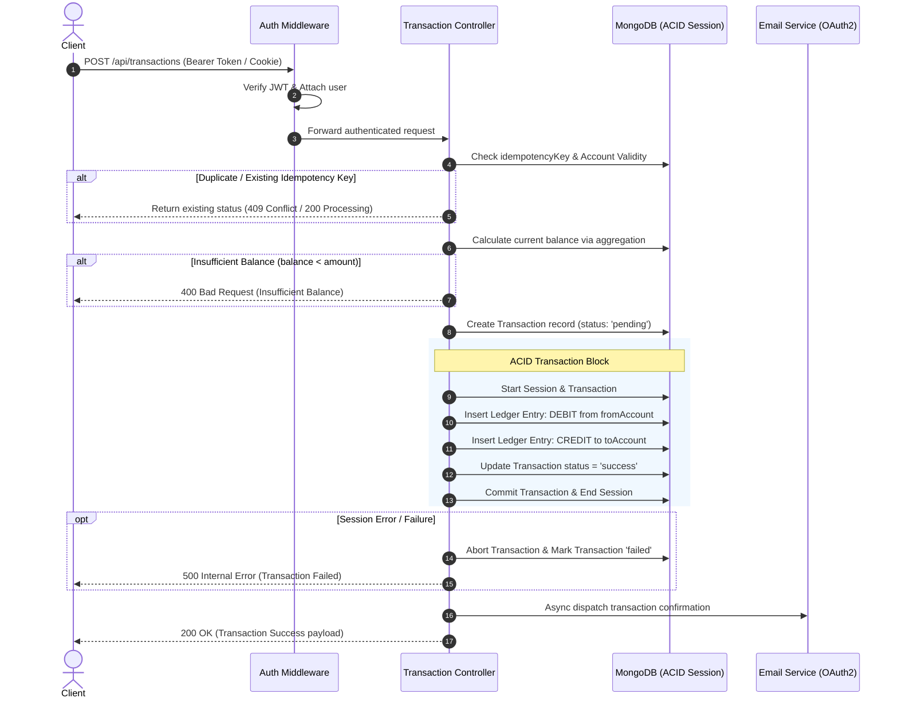
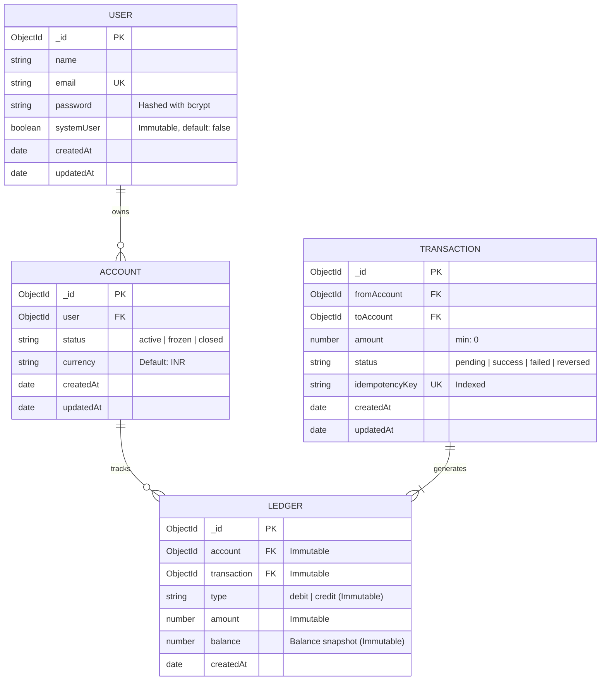

# 💳 Transaction Ledger API

[](https://nodejs.org/)
[](https://expressjs.com/)
[](https://www.mongodb.com/)
[](https://mongoosejs.com/)
[](https://jwt.io/)
[](https://opensource.org/licenses/ISC)

> **Enterprise-Grade, ACID-Compliant Double-Entry Ledger & Transaction Management Engine.**  
> Designed for high-integrity financial operations with strict immutability guarantees, idempotency protection, dynamic balance aggregation, and automated asynchronous email notifications.

---

## 📑 Table of Contents

- [Overview](#-overview)
- [Key Architectural Highlights](#-key-architectural-highlights)
- [System Architecture & Flow](#-system-architecture--flow)
- [Database Schema Design](#-database-schema-design)
- [API Reference](#-api-reference)
  - [Authentication & User Management](#1-authentication--user-management)
  - [Account Management](#2-account-management)
  - [Transactions & Ledger Operations](#3-transactions--ledger-operations)
- [Idempotency & Concurrency Model](#-idempotency--concurrency-model)
- [Project Directory Structure](#-project-directory-structure)
- [Getting Started](#-getting-started)
  - [Prerequisites](#prerequisites)
  - [Installation](#installation)
  - [Environment Configuration](#environment-configuration)
  - [Running the Server](#running-the-server)
- [Security & Integrity Protections](#-security--integrity-protections)
- [License](#-license)

---

## 📖 Overview

The **Transaction Ledger API** is a robust financial backend service engineered to address the critical challenges of distributed money movement: **double-spending**, **data inconsistency**, **duplicate charge execution**, and **ledger tampering**.

Built on a strict **Double-Entry Bookkeeping** paradigm, every financial event creates equal and offsetting debit and credit entries in an immutable ledger. Multi-document ACID transactions guarantee that account balances remain mathematically consistent across concurrent transfers.

---

## 🌟 Key Architectural Highlights

- **🔒 Immutable Double-Entry Ledger**:
  All ledger entries are write-only. Mongoose middleware blocks any update (`updateOne`, `findOneAndUpdate`, etc.) or delete (`deleteOne`, `deleteMany`, etc.) operations at runtime to ensure an audit-proof ledger.

- **⚛️ ACID Multi-Document Transactions**:
  Money transfers use MongoDB atomic sessions (`startSession`, `startTransaction`, `commitTransaction`, `abortTransaction`). If any step fails (e.g. debit succeeds but credit fails), the entire transaction rolls back automatically.

- **⚡ Strict Idempotency Controls**:
  Every transaction request requires a unique `idempotencyKey`. The API tracks state transitions (`pending` ➔ `success` / `failed` / `reversed`), eliminating duplicate charges caused by network timeouts or aggressive client retries.

- **📊 Dynamic Balance Aggregation**:
  Account balances are not stored as mutable scalar values prone to race conditions. Instead, balances are derived dynamically using MongoDB aggregation pipelines:  
  $$\text{Account Balance} = \sum \text{Credits} - \sum \text{Debits}$$

- **🔐 Dual-Layer Authentication & Authorization**:
  - Secure JWT session handling through both HTTP-only cookies and standard `Authorization: Bearer <token>` headers.
  - Role-based isolation with dedicated middleware for privileged `systemUser` operations (e.g. initial liquidity injection).

- **✉️ Automated Transaction Emails**:
  Built-in integration with Google OAuth2 Nodemailer service to asynchronously dispatch transactional alerts (account welcome, transfer success, transfer failure, and transaction reversals).

---

## 🏛 System Architecture & Flow

### 1. Transfer Lifecycle & Idempotency Pipeline



---

## 🗄 Database Schema Design



---

## 📡 API Reference

Base URL: `http://localhost:3000/api`

### 1. Authentication & User Management

#### 🔹 Register User
Creates a new user profile, sets an HTTP-only JWT cookie, and triggers a welcome email.

- **Endpoint**: `POST /api/users/register`
- **Auth Required**: No
- **Request Body**:
  ```json
  {
    "name": "Jane Doe",
    "email": "jane@example.com",
    "password": "StrongPassword123!"
  }
  ```
- **Responses**:
  - `201 Created`
    ```json
    {
      "success": true,
      "message": "User registered successfully",
      "token": "eyJhbGciOiJIUzI1NiIsInR5cCI6...",
      "data": {
        "_id": "66bf04a9e2...",
        "name": "jane doe",
        "email": "jane@example.com",
        "createdAt": "2026-08-17T18:00:00.000Z"
      }
    }
    ```
  - `400 Bad Request`: Validation failure or duplicate email.

---

#### 🔹 Login User
Authenticates user credentials and issues a JWT token via cookie and response payload.

- **Endpoint**: `POST /api/users/login`
- **Auth Required**: No
- **Request Body**:
  ```json
  {
    "email": "jane@example.com",
    "password": "StrongPassword123!"
  }
  ```
- **Responses**:
  - `200 OK`
    ```json
    {
      "success": true,
      "message": "Logged in successfully",
      "token": "eyJhbGciOiJIUzI1NiIsInR5cCI6...",
      "data": {
        "_id": "66bf04a9e2...",
        "name": "jane doe",
        "email": "jane@example.com"
      }
    }
    ```
  - `401 Unauthorized`: Invalid credentials.

---

#### 🔹 Logout User
Clears the session cookie.

- **Endpoint**: `POST /api/users/logout`
- **Auth Required**: Yes (`authMiddleware`)
- **Responses**:
  - `200 OK`
    ```json
    {
      "success": true,
      "message": "Logged out successfully"
    }
    ```

---

### 2. Account Management

#### 🔹 Create Account
Initializes a new ledger account associated with the authenticated user.

- **Endpoint**: `POST /api/accounts`
- **Auth Required**: Yes
- **Headers**: `Authorization: Bearer <token>` *(or Cookie)*
- **Responses**:
  - `201 Created`
    ```json
    {
      "success": true,
      "message": "Account created successfully",
      "data": {
        "_id": "66bf0581e2b5...",
        "user": "66bf04a9e2...",
        "status": "active",
        "currency": "INR",
        "createdAt": "2026-08-17T18:05:00.000Z",
        "updatedAt": "2026-08-17T18:05:00.000Z"
      }
    }
    ```

---

#### 🔹 Get User Accounts
Retrieves all accounts belonging to the authenticated user.

- **Endpoint**: `GET /api/accounts`
- **Auth Required**: Yes
- **Responses**:
  - `200 OK`
    ```json
    {
      "success": true,
      "message": "Accounts fetched successfully",
      "data": [
        {
          "_id": "66bf0581e2b5...",
          "user": "66bf04a9e2...",
          "status": "active",
          "currency": "INR",
          "createdAt": "2026-08-17T18:05:00.000Z"
        }
      ]
    }
    ```

---

#### 🔹 Get Account Balance
Computes and returns the real-time aggregated balance of a specific account owned by the user.

- **Endpoint**: `GET /api/accounts/balance/:accountId`
- **Auth Required**: Yes
- **URL Parameters**: `accountId` (MongoDB ObjectId)
- **Responses**:
  - `200 OK`
    ```json
    {
      "success": true,
      "message": "Account balance fetched successfully",
      "data": {
        "balance": 25000
      }
    }
    ```
  - `404 Not Found`: Account does not exist or does not belong to the user.

---

### 3. Transactions & Ledger Operations

#### 🔹 Execute Fund Transfer (Peer-to-Peer)
Executes an atomic transfer between two active accounts with full double-entry ledger bookkeeping.

- **Endpoint**: `POST /api/transactions`
- **Auth Required**: Yes
- **Request Body**:
  ```json
  {
    "fromAccount": "66bf0581e2b5c123456789aa",
    "toAccount": "66bf0595e2b5c123456789bb",
    "amount": 5000,
    "idempotencyKey": "tx_req_9876543210_abcdef"
  }
  ```
- **Responses**:
  - `200 OK` (Transfer Success)
    ```json
    {
      "success": true,
      "message": "Transaction created successfully",
      "transaction": {
        "_id": "66bf0631e2b5c123456789cc",
        "fromAccount": "66bf0581e2b5c123456789aa",
        "toAccount": "66bf0595e2b5c123456789bb",
        "amount": 5000,
        "status": "success",
        "idempotencyKey": "tx_req_9876543210_abcdef",
        "createdAt": "2026-08-17T18:10:00.000Z"
      }
    }
    ```
  - `400 Bad Request`: Insufficient funds, inactive account, or missing fields.
  - `409 Conflict`: Idempotency collision (transaction already completed or reversed).

---

#### 🔹 Initial Funds Injection (System Superuser Only)
Allows authorized system administrators (`systemUser: true`) to seed liquidity or initial balance into a user account.

- **Endpoint**: `POST /api/transactions/system/initialifund`
- **Auth Required**: Yes (`authSystemMiddleware`)
- **Request Body**:
  ```json
  {
    "toAccount": "66bf0581e2b5c123456789aa",
    "amount": 100000,
    "idempotencyKey": "sys_seed_0001_xyz"
  }
  ```
- **Responses**:
  - `200 OK` / `201 Created`
  - `401 Unauthorized`: Calling user is not a verified `systemUser`.

---

## 🛡️ Idempotency & Concurrency Model

In distributed financial architectures, client retries or network timeouts can easily cause accidental double charges. This API solves this via a resilient multi-stage pattern:

1. **Unique Idempotency Index**: An enforced unique index on `Transaction.idempotencyKey`.
2. **State Inspection**:
   - `success`: Returns `409 Conflict` containing the original transaction record.
   - `pending`: Returns `200 OK` indicating in-flight processing.
   - `failed`: Returns `400 Bad Request` enabling the client to generate a new key and retry.
   - `reversed`: Returns `409 Conflict`.
3. **Optimistic Pre-allocation**: Transactions are created with `pending` status before beginning the ACID database transaction, ensuring parallel concurrent requests with the identical key are immediately caught.

---

## 📂 Project Directory Structure

```plaintext
transaction-ledger-api/
├── .env.example                # Sample environment variables configuration
├── .gitignore                  # Git ignore rules
├── package.json                # Project dependencies & scripts
├── server.js                   # Application entrypoint & DB connection bootstrap
├── README.md                   # Comprehensive project documentation
└── src/
    ├── app.js                  # Express application setup, routes & middleware mounting
    ├── config/
    │   └── db.js               # MongoDB connection logic (Mongoose)
    ├── controllers/
    │   ├── account.controllers.js       # Account creation & balance aggregation logic
    │   ├── transaction.controllers.js   # Transaction processing, ACID sessions & ledgering
    │   └── user.controllers.js          # Authentication (register, login, logout)
    ├── middleware/
    │   └── auth.middleware.js           # JWT verification & systemUser guards
    ├── models/
    │   ├── account.models.js            # Account schema & balance aggregation methods
    │   ├── ledger.models.js             # Immutable double-entry ledger schema
    │   ├── transaction.models.js        # Transaction schema & idempotency indexes
    │   └── user.models.js               # User schema, password hashing & JWT token generator
    ├── routes/
    │   ├── account.routes.js            # Account routing definitions
    │   ├── transaction.routes.js        # Transaction routing definitions
    │   └── user.routes.js               # User authentication routing definitions
    └── services/
        └── email.js                     # Nodemailer OAuth2 client & email dispatch templates
```

---

## 🚀 Getting Started

### Prerequisites

- **Node.js**: v18.0.0 or higher
- **npm** or **yarn**
- **MongoDB**: v6.0+ (MongoDB Atlas or a local **Replica Set** is required to support multi-document transactions)
- **Google Cloud Console Credentials**: OAuth2 Client ID & Refresh Token (for transactional emails)

### Installation

1. **Clone the Repository**:
   ```bash
   git clone https://github.com/Himanshux07/transaction-ledger-api.git
   cd transaction-ledger-api
   ```

2. **Install Dependencies**:
   ```bash
   npm install
   ```

### Environment Configuration

Create a `.env` file in the root directory by copying the example:

```bash
cp .env.example .env
```

Populate the required environment variables:

```env
# Server
PORT=3000
NODE_ENV=development

# Database (Replica set connection URI)
MONGO_URI=mongodb+srv://<username>:<password>@cluster0.mongodb.net/transaction-ledger?retryWrites=true&w=majority

# Authentication
JWT_SECRET=your_jwt_secret_key_change_in_production
JWT_EXPIRES_IN=7d

# Google OAuth2 for Email Notifications
EMAIL_USER=your_email@gmail.com
CLIENT_ID=your_google_client_id.apps.googleusercontent.com
CLIENT_SECRET=your_google_client_secret
REFRESH_TOKEN=your_google_oauth_refresh_token
```

### Running the Server

#### Development Mode (with Hot Reloading via Nodemon):
```bash
npm run dev
```

#### Production Mode:
```bash
npm start
```

The server will start listening on port `3000` (or `process.env.PORT`):
```plaintext
Server is running on port 3000
MongoDB connected
Email server is ready to send messages
```

---

## 🔒 Security & Integrity Protections

| Layer | Implementation Detail |
| :--- | :--- |
| **Password Security** | Passwords hashed using `bcrypt` with salt rounds = 10; never stored in plaintext. |
| **JWT Storage** | Issued via `httpOnly`, `sameSite: "strict"`, and `secure` (in production) cookies to mitigate XSS. |
| **Query Protection** | Password field is explicitly excluded (`select: false`) in sensitive lookups. |
| **Ledger Immutability** | Database hooks prevent any accidental or malicious `UPDATE` or `DELETE` operations on the `Ledgers` collection. |
| **Negative Balances** | Schema-level constraints (`min: 0`) and runtime balance checks prevent overdrafts. |
| **Atomicity** | Two-phase commit logic via MongoDB sessions ensures no partial state persists if transfer fails. |

---

## 📄 License

This project is licensed under the [ISC License](LICENSE).
